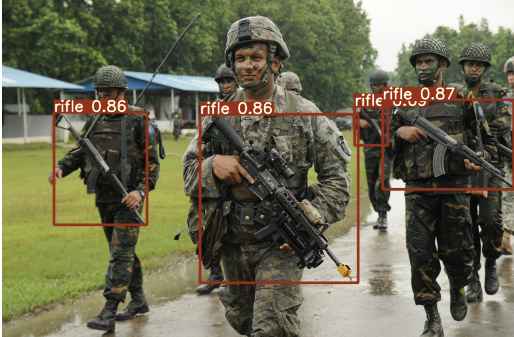
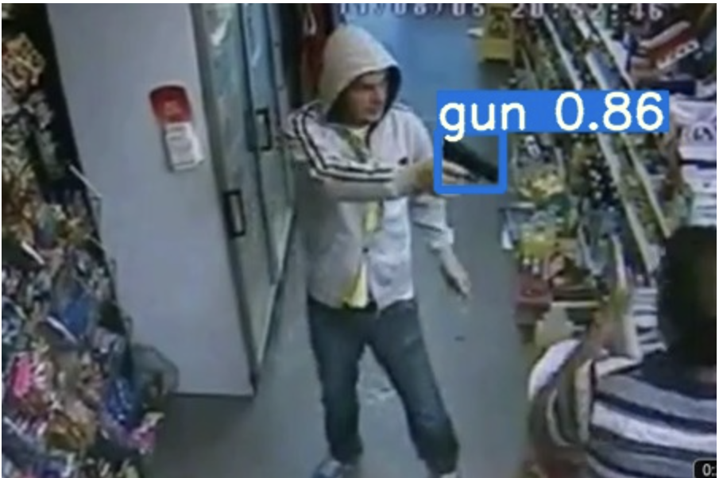
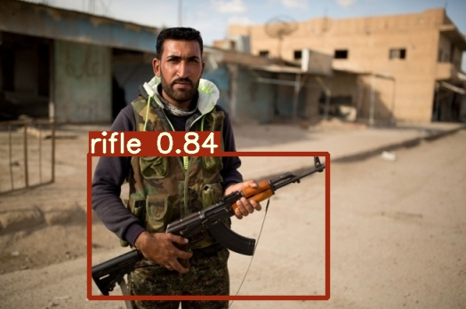
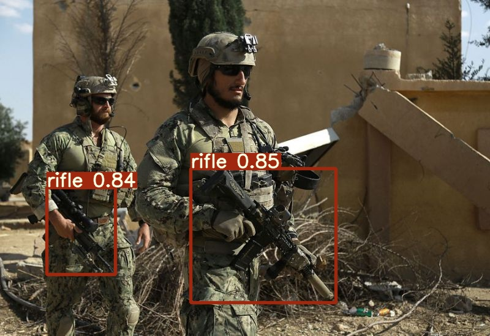
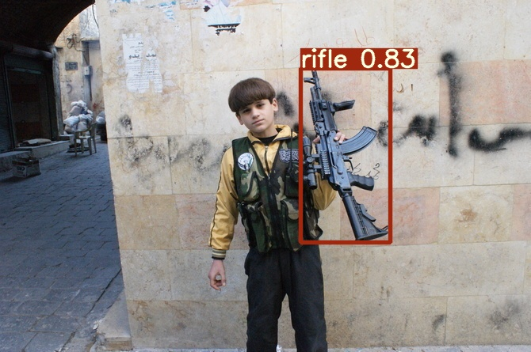
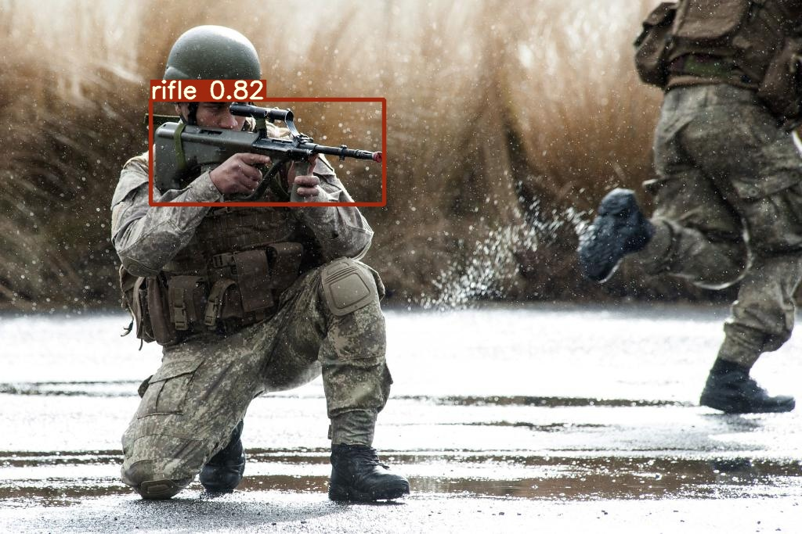

# GunDetection
Kids should be safe at school. In this project, we at AIForMankind develop an YOLOv7 model to detect guns, which we hope to deploy in California schools to prevent school shootings. 

Here are some sample results from the model:

